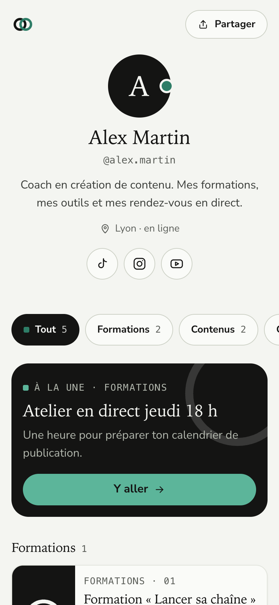
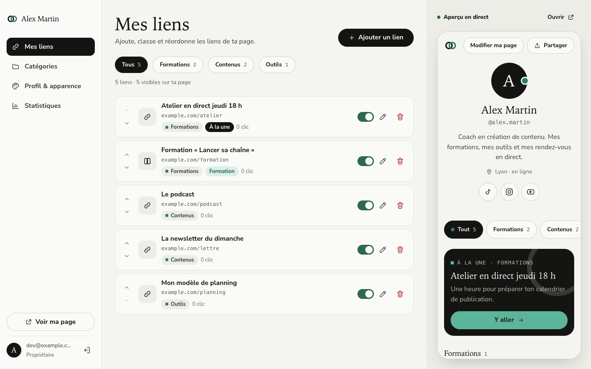

# CircleLink

> **In English.** CircleLink is a self-hosted “link in bio” page (like Linktree, Beacons or Stan Store) with an admin, for one owner. Links open without warnings from TikTok, Instagram and Facebook: no redirects, no shared domain. Deploy it on Coolify in three clicks (the `docker-compose.yml` ships its own PostgreSQL and Coolify generates every secret), or anywhere with Docker in two commands. The interface is in French. MIT licensed.

Ta page « lien en bio » à toi, sur ton serveur : un profil, tes liens classés par catégorie, des statistiques de clics, et un back-office pour tout gérer. Les liens s’ouvrent sans avertissement depuis TikTok, Instagram et Facebook.

<p>
  
  
</p>

- **Page publique** `/` : photo, nom, bio, réseaux sociaux, onglets par catégorie, carte « À la une », cartes formation, liens, newsletter facultative.
- **Espace** `/admin` : liens (ajout, édition, ordre, masquage, suppression avec annulation), catégories, profil et apparence (thème clair ou sombre, forme des liens, photo), statistiques (clics par lien, par catégorie, par provenance : TikTok, Instagram, Facebook…), aperçu en direct.
- **API** `/api/v1` : tout le contenu s’écrit aussi par une API REST, avec une clé.

## Installer

### Sur Coolify (recommandé)

1. **Nouvelle ressource** → **Public Repository** → l’URL de ce dépôt → type **Docker Compose** (fichier `docker-compose.yml`).
2. Sur le service **app**, indique ton domaine (par exemple `https://liens.mondomaine.fr`).
3. **Déployer.**

Coolify crée l’app et sa base PostgreSQL, génère les mots de passe et le secret de session, et donne ton domaine à l’app. Rien d’autre à saisir.

### Avec Docker, ailleurs

Sur un serveur avec Docker et Git :

```bash
git clone https://github.com/jdecampos/circlelink-open.git && cd circlelink-open
./scripts/init-env.sh https://liens.mondomaine.fr   # écrit .env avec des secrets tirés au hasard
docker compose up -d                                # l'app écoute sur le port 3000
```

`init-env.sh` refuse d’écraser un `.env` existant : ses mots de passe sont ceux de la base. Mets un proxy HTTPS devant le port 3000 (Caddy, Traefik, nginx) : les réseaux sociaux se méfient des liens en `http://`.

Sur un VPS nu, ajoute avant ces commandes l’installation de Docker : `curl -fsSL https://get.docker.com | sh`.

### Premier lancement

Au premier démarrage, le conteneur écrit dans ses journaux un **code d’installation** :

```
──────────────────────────────────────────────────────
 CircleLink : installation
 Ouvre https://liens.mondomaine.fr/installation
 Code d’installation : 7KQ2-X9PD-…
──────────────────────────────────────────────────────
```

Sur Coolify : onglet **Logs** du service app. Avec Docker : `docker compose logs app`. Ouvre `/installation`, recopie le code, choisis ton email et ton mot de passe : ton compte est créé, tu arrives dans ton espace. Le code évite qu’un inconnu prenne ton instance avant toi ; une fois le compte créé, `/installation` n’existe plus.

## Configurer

Toutes les variables sont lues au démarrage : modifie-les, puis redémarre (Coolify : **Restart**, Docker : `docker compose up -d`). Pas besoin de reconstruire l’image.

| Variable | Obligatoire | Rôle |
|---|---|---|
| `SITE_URL` | oui, fournie par Coolify ou `init-env.sh` | URL publique : balises de partage, emails, `robots.txt`, sitemap |
| `DATABASE_URL`, `DATABASE_MIGRATION_URL`, `BETTER_AUTH_SECRET` | oui, générées | Base et sessions |
| `SMTP_HOST`, `SMTP_PORT`, `SMTP_USER`, `SMTP_PASSWORD`, `SMTP_FROM` | non | Lien magique et mot de passe oublié |
| `MAUTIC_URL`, `MAUTIC_USERNAME`, `MAUTIC_PASSWORD`, `MAUTIC_SEGMENT_ALIAS` | non | Newsletter |

Une variable obligatoire absente arrête le démarrage avec un message qui la nomme.

### Emails (facultatif)

Sans SMTP, la connexion se fait par mot de passe. Avec un SMTP transactionnel (Resend, Brevo, Postmark…), renseigne `SMTP_HOST` et `SMTP_FROM` (et `SMTP_USER`, `SMTP_PASSWORD`, `SMTP_PORT` au besoin) : l’écran de connexion propose alors aussi le lien magique et « Mot de passe oublié ».

**Mot de passe oublié, sans SMTP** : depuis le serveur,

```bash
docker compose exec app node scripts/reset-password.mjs ton@email.fr
```

La commande affiche un lien à usage unique, valable 15 minutes. Sur Coolify, lance `node scripts/reset-password.mjs ton@email.fr` dans le **Terminal** du service app.

### Newsletter Mautic (facultatif)

Sans Mautic, la page n’affiche pas de bloc newsletter. Avec Mautic, chaque inscription crée ou met à jour un contact, avec le tag `circleLink` et un tag de provenance (`source-tiktok`, `source-instagram`…). Si Mautic ne répond pas, l’inscription attend dans une file que l’app retente elle-même toutes les 15 minutes, pendant 24 h.

1. Dans Mautic, **Configuration → Paramètres de l’API** : active l’API **et** l’authentification HTTP basique.
2. Crée un utilisateur dédié, avec un rôle limité aux contacts (lecture, création, modification).
3. Crée le segment des inscrits joignables (alias `circlelink-joignables`, ou celui de `MAUTIC_SEGMENT_ALIAS`) : « tag = circleLink » ET « désinscrit (email) = non ». C’est lui que compte la page Statistiques.
4. Renseigne `MAUTIC_URL`, `MAUTIC_USERNAME` et `MAUTIC_PASSWORD`, puis redémarre.

### API

1. **Espace → Profil & apparence → Clé API** : « Générer une clé ». Elle n’est affichée qu’une fois ; la base n’en garde que l’empreinte.
2. Chaque appel envoie `Authorization: Bearer cl_…`.
3. Documentation interactive : **`/api/docs`** ; document OpenAPI 3.1 : `/api/v1/openapi.json`.

```bash
curl -X POST https://liens.mondomaine.fr/api/v1/import \
  -H "Authorization: Bearer $CIRCLELINK_API_KEY" -H "Content-Type: application/json" \
  -d '{"categories":[{"name":"Podcast","links":[{"title":"Épisode 1","url":"https://example.com/ep1"}]}]}'
```

`POST /api/v1/import` remplit la page en un appel, tout ou rien, sans effacer l’existant.

## Mettre à jour

Les versions sont étiquetées (`v1.0.0`, `v1.1.0`…) ; le [journal des modifications](CHANGELOG.md) dit ce que chacune change.

- **Coolify** : **Redeploy** (la branche `main` suit la dernière version stable).
- **Docker** : `git pull && docker compose up -d --build` (ou `git checkout v1.1.0` pour une version précise).

Au démarrage, le conteneur applique les migrations de la base ; ton contenu, ton compte, tes clés API et tes statistiques sont gardés.

## Sauvegarder et restaurer

Depuis le dossier du dépôt (avec Docker) :

```bash
docker compose exec -T db pg_dump -U circlelink_owner -d circlelink --clean --if-exists > sauvegarde.sql   # sauvegarde
docker compose exec -T db psql -U circlelink_owner -d circlelink < sauvegarde.sql                          # restauration
```

Sur Coolify, la base fait partie de la ressource : utilise ses **sauvegardes planifiées**, ou les mêmes commandes avec `docker exec` sur le conteneur `db`. Les données vivent dans le volume `db-data` : `docker compose down` les garde, `docker compose down -v` les efface.

## Pourquoi les liens passent sur TikTok, Instagram, Facebook…

Les applis sociales affichent « lien dangereux » quand le domaine a mauvaise réputation, quand il y a des redirections en chaîne (raccourcisseurs, traceurs) ou quand la page est lente. Ce que fait CircleLink :

1. **Ton propre domaine**, en HTTPS avec HSTS. Pas de domaine partagé ni de raccourcisseur.
2. **Aucune redirection** : chaque bouton pointe directement vers sa vraie destination. Le comptage des clics part en arrière-plan (`navigator.sendBeacon` → `/api/click`).
3. **Page servie depuis le cache** : aucune requête en base à chaque visite, aucun appel lié à la connexion pour un visiteur.
4. **Balises Open Graph** et image d’aperçu générée.
5. **En-têtes de sécurité**, `robots.txt` et `sitemap.xml` propres, pages privées en `noindex`.
6. **Liens validés côté serveur et en base** : seuls `https://`, `http://` et `mailto:` sont acceptés.

À faire de ton côté : n’ajoute que des destinations fiables, et vérifie ton domaine sur [Google Safe Browsing](https://transparencyreport.google.com/safe-browsing/search).

## Sécurité

- **Seule la propriétaire écrit** : chaque action de l’espace vérifie la session et l’adresse propriétaire ; chaque route d’écriture de l’API vérifie la clé. L’installation est la seule écriture sans session, une seule fois, avec le code.
- **Rôle PostgreSQL limité** : l’app lit et écrit les données mais ne peut ni modifier le schéma ni créer de rôle. La base n’expose aucun port.
- **Secrets** : générés par Coolify ou par `init-env.sh`, jamais dans le dépôt ni dans l’image.
- **Emails** : le lien magique et la réinitialisation ne partent qu’à l’adresse propriétaire ; aucun email d’inscrit dans les journaux.

Une faille ? Voir [SECURITY.md](SECURITY.md).

## Développer

Prérequis : Docker, Node 22 ou plus, [pnpm](https://pnpm.io).

```bash
pnpm install
cp .env.example .env.development.local   # puis renseigne BETTER_AUTH_SECRET (openssl rand -hex 32)
pnpm db:up                                # PostgreSQL 18 (port 54329) + smtp4dev (http://localhost:5080)
pnpm db:migrate                           # base, tables, rôle applicatif, code d'installation
pnpm dev                                  # http://localhost:3000/installation
```

```bash
pnpm lint && pnpm typecheck
pnpm test         # unitaires + base PGlite en mémoire (sans Docker)
pnpm test:pg      # + intégration sur le PostgreSQL de compose.dev.yaml
```

Les principes du projet sont dans [`specs/constitution.md`](specs/constitution.md) ; la marche à suivre pour proposer une modification, dans [CONTRIBUTING.md](CONTRIBUTING.md).

## Licence

[MIT](LICENSE). La police Nunito Sans est sous licence SIL Open Font License (`public/fonts/`).
